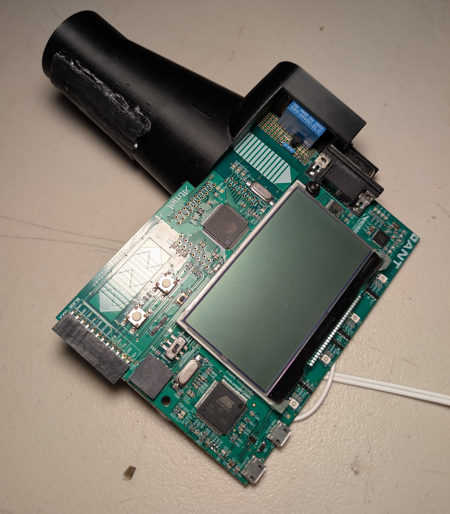
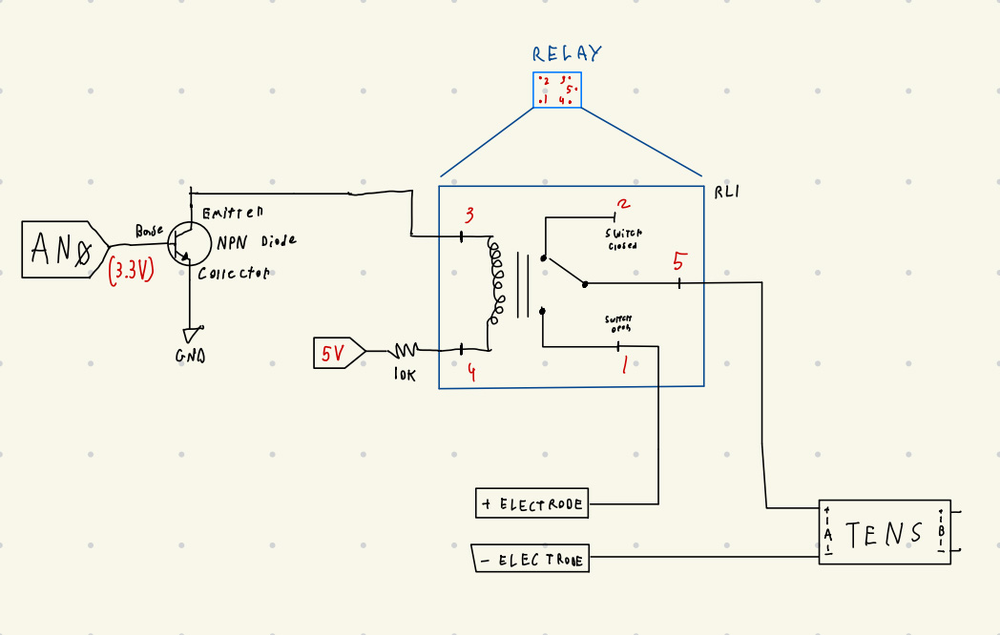
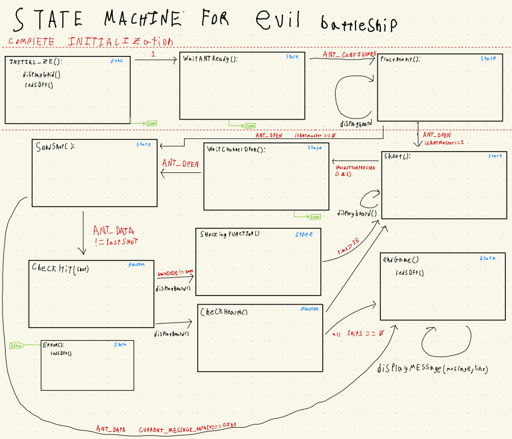

# Evil Battleship — TENS Shock Edition (EiE Devboard)

**Final project** from the *Embedded in Embedded* group (University of Calgary) by **Django Schmidt** & **Chase Mackenzie**. Built over ~2 months on the EiE custom devboard. When your ship gets hit… you get zapped via a TENS unit driven by a relay. ⚡

> **What is the EiE devboard?**  
> A custom embedded system with foundational libraries by the EiE & Garmin team. It provides a **dot-matrix display**, **LEDs**, **buzzer**, **ANT (wireless) communication**, **buttons**, and **3.3 V toggleable output pins**.

<!-- HERO: leave room for image -->


**Provenance / Base Code:** We forked the master branch provided by the EiE group. ALL OF MY COMMITS didn’t show up on my profile; please see my partner’s repository for the full history:  
👉 https://github.com/Chamer5465/EIE_Project/tree/master

---

## Table of Contents

- [What I Contributed](#what-i-contributed)
- [Features](#features)
- [Hardware Hookups](#hardware-hookups)
- [Safety First ⚠️](#safety-first-️)
- [Demo](#demo)
- [Build & Flash (Waf)](#build--flash-waf)
- [Design Goals](#design-goals)
- [What We’d Change in Rev. 2](#what-wed-change-in-rev-2)
- [What We Learned](#what-we-learned)
- [Challenges We Hit](#challenges-we-hit)
- [Credits](#credits)
- [License](#license)

---

## What I Contributed

- Designed and soldered the relay + transistor switching circuit interfacing with the TENS unit.
- Designed, prototyped, and 3D-printed the handle/holder in Fusion 360.
- Created the presentation materials.
- Implemented key game logic and app state code, including:
    `placement`, `sendShot`, `UserApp1Initialize`, `ledsOff`, 
    `UserApp1RunActiveState`, `UserApp1SM_WaitAntReady`, 
    `UserApp1SM_WaitChannelOpen`, `UserApp1SM_Error`, 
    `endGame`, `shockingFunction`, `checkHit`, `displayMessage`.
- Coded `displayGrid` + `shoot` in collaboration with Chamer5465.

---

## Features

- Short-form **Battleship™** adapted for the EiE devboard
- **Attention-grabbing design twist:** TENS shock on *hit* ⚡
- Uses multiple board peripherals: dot-matrix, LEDs, buzzer, buttons, ANT radio
- Simple state-machine architecture for clear game flow
- Two supported build targets:
  - `ASCII` (terminal simulation)
  - `DOT_MATRIX` (on-board dot-matrix display)

Additional notes to include:
- This project uses a **TENS unit** to shock the user when a battleship is hit.
- On the devboard we **soldered a relay + transistor** to switch the TENS unit.  
  <!-- leave room for image -->
  

---

## Hardware Hookups

- **TENS unit output** is gated by a **relay** driven through a **transistor** from a 3.3 V GPIO.
- Ensure the relay coil voltage and driver transistor (with base/gate resistor) match the board’s capabilities.
- Add a **flyback diode** across the relay coil if required by your relay spec.

> **Note:** Choose low-current relays compatible with the EiE board’s drive or add a proper driver stage.

---

## Safety First ⚠️

> **WARNING:** TENS devices deliver electrical stimulation and can be dangerous if misused.  
> - Do **not** use on anyone with implanted electronic devices (e.g., pacemakers) or known contraindications.  
> - Keep current paths away from the chest/heart and head.  
> - Use **lowest** intensity for demos.  
> - Obtain consent and provide a no-shock opt-out mode.  
> - This repository is for educational purposes; you assume all responsibility.

---

## Demo

<!-- leave room for image -->


---

## Build & Flash (Waf)

### Quick Start

```bash
# 1) Configure once (choose ONE of the boards)
./waf configure --board=ASCII
# or
./waf configure --board=DOT_MATRIX

# 2) Build
./waf build

# 3) Build & flash (if flashing is supported on your setup)
./waf build -F
```

**Command reference:**
```bash
python waf -?
python waf configure --board=ASCII
python waf configure --board=DOT_MATRIX
python waf build
python waf build -F
```

> If configuration succeeds, you typically only need to run it once per board type.

---

## Design Goals

- Short-form **Battleship™**
- **Attention-grabbing** shock feedback
- Exercise the **full capabilities** of the EiE Board


---

## What We’d Change in Rev. 2

- Fix **hardfault** root cause(s)
- Clean up **wiring** and strain relief
- Improve **user interface**/inputs
- **Optimize code** paths and timing
- Incorporate unused EiE peripherals
- **Full-cover enclosure** / better **ergonomics**

---

## What We Learned

- Coding with **states** for embedded apps  
  <!-- leave room for image -->
  

- Working under **time constraints**
- **Wireless** communication (ANT)
- **Hard faults** & low-level **debugging**  
- **Transistors** & **relays** for safe switching
- Accessing / decoding **registers**
- General **low-level** embedded coding

---

## Challenges We Hit

- Reliable **ANT** communication
- Intermittent **hardfault**
- **Low-voltage relay** activation margin

---

## Credits

- **evil battleship** — *Django Schmidt & Chase Mackenzie*  
- **Base code**: EiE group master branch  
- **Full history & reference repo**: https://github.com/Chamer5465/EIE_Project/tree/master  
- Thanks to EiE & Garmin teams for the devboard and libraries.

